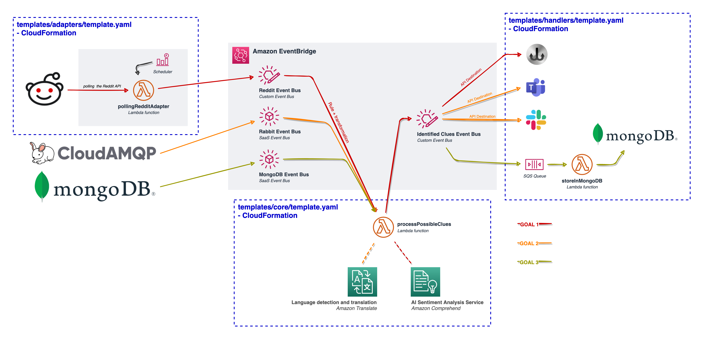
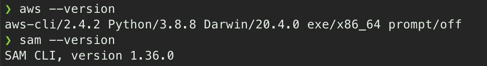
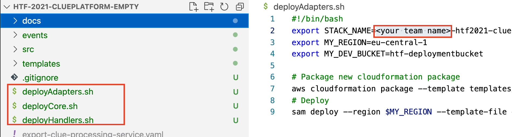
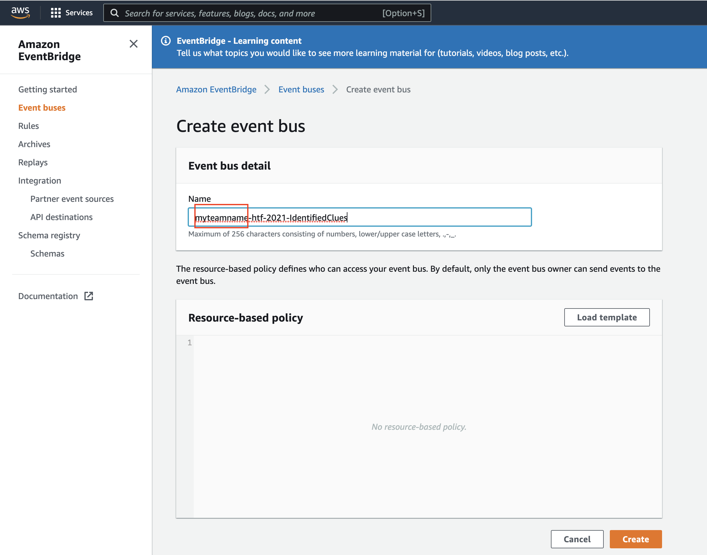
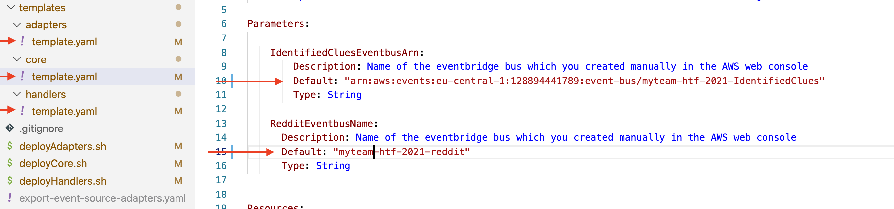

# htf-2021-clueplatform


## Environment setup

1. install AWS cli
https://docs.aws.amazon.com/cli/latest/userguide/install-cliv2.html

2. install AWS SAM CLI (including docker)
https://docs.aws.amazon.com/serverless-application-model/latest/developerguide/serverless-sam-cli-install.html

3. install nodejs version 14 + npm



```bash
# setup aws connection
aws configure
```


## Getting started

1. Adjust deploy scripts


2. Create your teams eventbridge eventbus

"myteamname-htf-2021-IdentifiedClues" and "myteamname-htf-2021-reddit" (see also overview)

3. Update templates

## Local development

```bash

# install existing depedencies
cd src/adapters/fn-sourceAdapterReddit/
npm install

# Adding new npm dependencies to function
npm install --save snoowrap

# Execute function locally, optional add  --skip-pull-image 
# Execute from project root folder
sam local invoke FnClueProcessor --event ./events/clueProcessingInput.json -t templates/core/template.yaml

sam local invoke FnSourceAdapterReddit --event ./events/testEvent.json -t templates/adapters/template.yaml

# creating new function
cd src/../
mkdir fn-xxxx
cd fn-xxxx
npm init #All defaults are ok

```

## Deploy function to cloud

```bash
# see inside script for more info
bash deployAdapters.sh

bash deployChannels.sh

bash deployCore.sh

```
